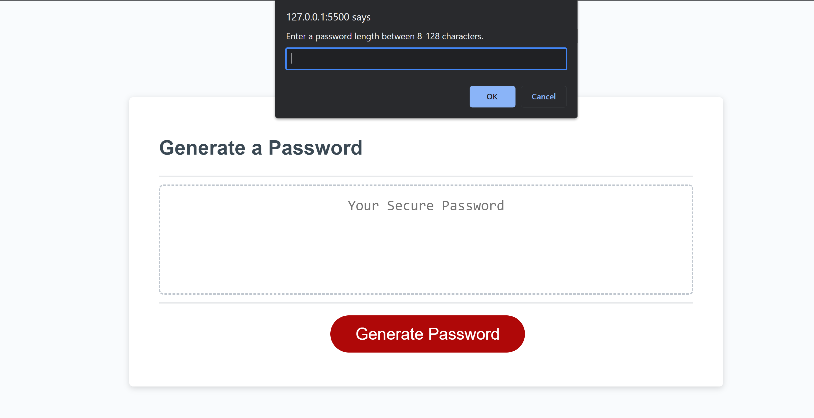

Password Generation

This webpage was created to generate a random password for the user using symbols, numbers and letters.

Usage
When entering the webpage the user will be asked how many characters you want the password length to be.  You will then be prompted if you want to add lowercase or symbols to your password.  Once selected the password will be generated. The user can click the generate button as many times to generate as many different passwords with their selected criteria.

Credits
Kelvin Roundtree Git hub link: https://github.com/Hampton-Kalvino :)

License
